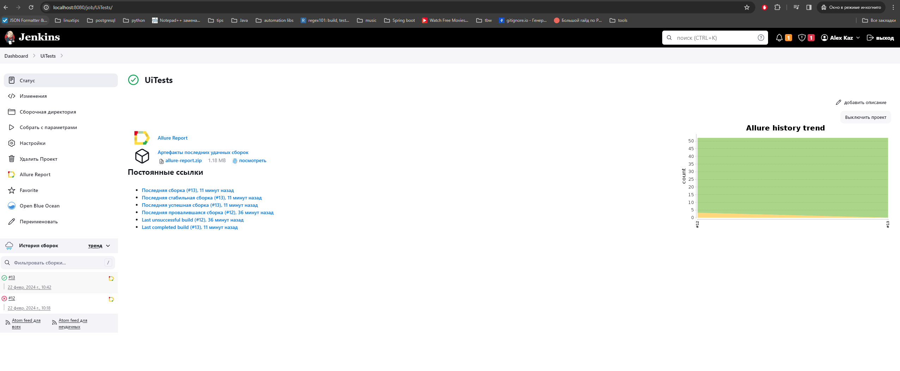
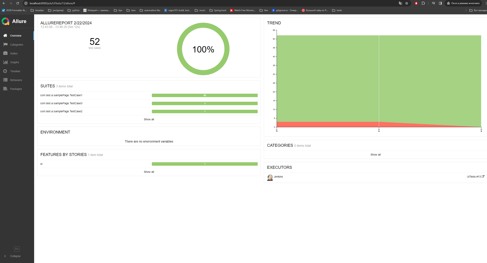
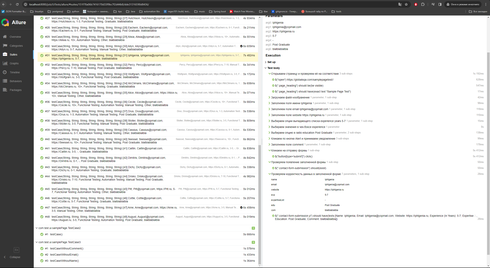
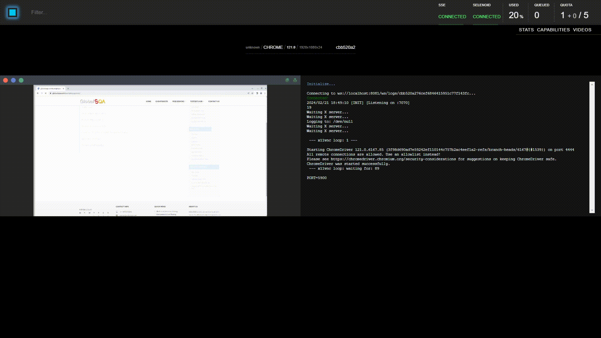

# Проект по автоматизации тестирования сайта globalsqa.com

<br>
<p align="center">

</p>
<br>

## Содержание:

- [Использованный стек технологий](#Использованный-стек-технологий)
- [Реализованные проверки](#Реализованные-проверки)
- [Запуск тестов](#запуск-тестов)
- [Сборка в Jenkins](#-сборка-в-jenkins)
- [Пример Allure-отчета](#-пример-allure-отчета)
- [Деплой и запуск теста в Selenoid](#-видео-примера-запуска-теста-в-selenoid)

##  Использованный стек технологий

<p align="center">


</p>

Автотесты написаны на <code>Java</code> с использованием <code>JUnit 5</code> и <code>Gradle</code>.
Для UI-тестов использован фреймворк [Selenide](https://selenide.org/).
Запуск тестов можно осуществлять локально или с помощью [Selenoid](https://aerokube.com/selenoid/).
Также реализована сборка в <code>Jenkins</code> с формированием Allure-отчета.

Allure-отчет включает в себя:
* шаги выполнения тестов;
* скриншот страницы в браузере в момент окончания автотеста;
* Page Source;
* логи браузерной консоли;


## Реализованные проверки

- [x] *Проверка формы регистрации с популярными типами полей использующихся для ввода данных.*
- [x] *Проверка и оптимальное покрытие всех обязательных параметров регистрации используя методику Pairwise testing с помощью сгенерированного CSV data-provider.*
- [x] *Проверка соответствия входных данных с результативной формой.*


## Запуск тестов

### Локальный запуск тестов
```
gradle clean test -Denv=local
```

При необходимости можно переопределить параметры запуска
```
test/smoke/regress - запуск всех тестов/только smoke/только regress

```

### Запуск тестов на удаленном браузере
```
gradle clean test -Denv=remote
```
При необходимости также можно переопределить параметры запуска

```
test/smoke/regress - запуск всех тестов/только smoke/только regress
```

##  Сборка в Jenkins
<p align="center">

</p>

##  Пример Allure-отчета
### Overview

<p align="center">

</p>

### Результат тестов

<p align="center">

</p>

###  Видео примера запуска теста в Selenoid

Для каждого прогона тестов пишется  видео и доступен VNC, как на гифке.
<p align="center">
  
</p>
